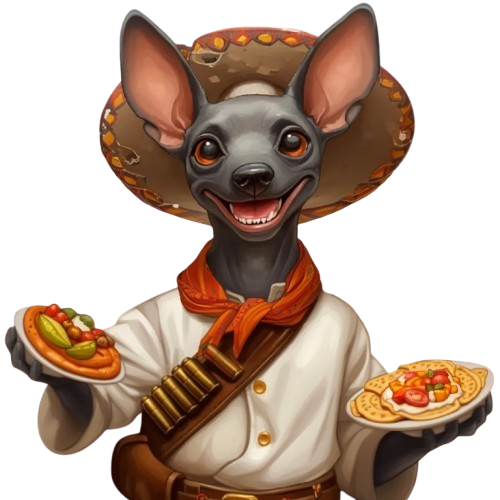
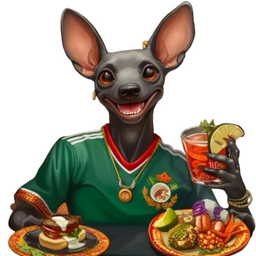

<div align="center">


# Saborea la Historia

### *Taste History — An Interactive Journey Through Mexican Gastronomy*

[](https://d3js.org/)
[](https://maplibre.org/)
[](https://p5js.org/)
[](https://getbootstrap.com/)
[](https://github.com/russellsamora/scrollama)

---

*A data-driven interactive documentary that explores **7,000+ years** of Mexican culinary heritage, structured as a four-course meal and guided by **Xolin**, a xoloitzcuintle spirit guardian of flavors and stories.*

</div>

---

## About

**Saborea la Historia** transforms Mexico's gastronomic evolution into an immersive scrollytelling experience. By combining rich historical narrative with interactive data visualizations, the project reveals how ingredients, techniques, and cultural encounters shaped one of the world's most celebrated cuisines — recognized by UNESCO as Intangible Cultural Heritage of Humanity (2010).

Each historical era is presented as a course in a traditional Mexican *menu de cuatro tiempos*:

| Course | Era | Period | Highlights |
|--------|-----|--------|------------|
| **Aperitivo** | Pre-Hispanic Mexico | 7000 BCE – 1521 | 5 foundational ingredients, 46 regional specialties, the milpa system |
| **Primer Plato** | Conquest & Colonial | 1521 – 1810 | 224 new ingredients, mestizo cuisine, convent kitchens as labs |
| **Segundo Plato** | European Influence & Revolution | 1810 – 1950 | French haute cuisine vs. popular traditions, Adelitas spreading recipes |
| **Postre** | Contemporary Mexico | 1950 – Present | 32 internationally recognized restaurants, UNESCO heritage |

---

## Meet Xolin

<div align="center">




</div>

**Xolin** is a xoloitzcuintle — the ancient Mexican hairless dog — who serves as the project's narrative guide. Rooted in Mesoamerican mythology as a spiritual companion, Xolin transforms through each historical era, adopting the visual identity of each period while leading the viewer through centuries of culinary evolution.

---

## Visualizations

The project features a rich set of custom-built interactive visualizations:

### Circular Network Graph
A 4-level radial hierarchy built with **D3.js** connecting historical epochs to ingredient origins, dish names, and culinary categories. Dynamically filters as the user scrolls through each foundational ingredient.

### Interactive Choropleth Map
A **MapLibre GL** map showing ingredient trade routes and regional distribution across Mexican states, with animated connection paths, pulse markers, and category-based filtering.

### Cultural Radial Chart
A **p5.js** particle-based visualization representing ingredient distribution across indigenous cultures and geographic regions.

### Radial Bar Charts
Per-ingredient state-level distribution charts with animated number counters showing the reach of each foundational ingredient.

### Scroll-Triggered Storytelling
Powered by **Scrollama**, the narrative responds to the user's scroll position — triggering graph filters, animated transitions, and contextual data reveals.

---

## Tech Stack

| Layer | Technologies |
|-------|-------------|
| **Core** | HTML5, CSS3, Vanilla JavaScript (ES6+) |
| **Layout** | Bootstrap 5.1.3, Custom CSS Grid System |
| **Data Viz** | D3.js v7, p5.js 1.9, Scrollama 3.2 |
| **Mapping** | MapLibre GL v5.5, Leaflet 1.7, Stadia Maps tiles |
| **Animation** | TypeIt 8.7 (typing effects), CSS @keyframes, custom transitions |
| **Typography** | Libre Baskerville, Cardo, Source Code Pro (Google Fonts) |
| **Data** | GeoJSON, JSON, CSV (~1.3 MB dish database) |

---

## Design

The visual identity draws from a **San Angel colonial museum** aesthetic:

- **Paper grain textures** and matte shadows evoking aged manuscripts
- **Serif typography** (Libre Baskerville + Cardo) for scholarly elegance
- **Warm, earthy palette** inspired by Mexican colonial architecture:

| Swatch | Hex | Role |
|--------|-----|------|
|  | `#243360` | Navy — primary text |
|  | `#5a3e28` | Brown — accents |
|  | `#c49a6c` | Gold — highlights |
|  | `#8b7355` | Warm gray — secondary |
|  | `#F6F0E4` | Cream — background |

---

## Project Structure

```
saborea-la-historia/
├── index.html                     # Main entry point
├── sections/                      # Dynamically loaded HTML sections
│   ├── hero.html                  #   Landing with TypeIt animation
│   ├── intro-menu.html            #   Menu introduction
│   ├── aperitivo.html             #   Pre-Hispanic era
│   ├── primer-plato.html          #   Conquest & Colonial
│   ├── segundo-plato.html         #   Revolution era
│   ├── postre.html                #   Contemporary Mexico
│   └── footer.html                #   Credits & navigation
├── js/
│   ├── section-loader.js          # Dynamic section orchestrator
│   ├── circularGraph.js           # D3 circular network graph
│   ├── filteredConnectionMap.js   # MapLibre interactive map
│   ├── culturalRadialChart.js     # p5.js particle chart
│   ├── radialBarChart.js          # State-level bar charts
│   ├── categoryRing.js            # Category ring visualization
│   ├── aperitivo.js               # Scrollama scroll triggers
│   └── ...                        # Animation & utility scripts
├── css/
│   ├── main.css                   # Master stylesheet
│   ├── base/                      #   Variables, typography, cursor
│   ├── components/                #   Cards, KPIs, menus, buttons
│   ├── layouts/                   #   Grid system, sticky elements
│   ├── visualizations/            #   Chart & graph styles
│   ├── animations/                #   Keyframes & transitions
│   └── responsive.css             # Mobile & tablet breakpoints
├── json/                          # Data files
│   ├── OTROS/                     #   GeoJSON, state data, routes
│   └── platillos_expandido.csv    #   1.3 MB dish database
└── img/
    ├── Xolin/                     # Character illustrations
    ├── aperitivo/                 # Ingredient illustrations
    ├── inicio/                    # Hero section assets
    └── ...                        # Title graphics & decorations
```

---

## Getting Started

This is a static web project with no build step required.

```bash
# Clone the repository
git clone https://github.com/YOUR_USERNAME/saborea-la-historia.git
cd saborea-la-historia

# Serve locally (any static server works)
npx serve .
# or
python -m http.server 8000
```

> **Note:** A local server is required because the project uses `fetch()` to dynamically load HTML sections.

---

## Data Sources

The project draws from extensive research into Mexican culinary history:

- **1,300+ dishes** catalogued across all historical periods
- **State-level GeoJSON** boundaries for geographic visualizations
- **Trade route geometries** mapping ingredient movement across Mexico
- **Ingredient classification** by origin, culture, and culinary category
- Primary reference: *Larousse de la Gastronomía Mexicana*

---

## Author

**Sergio Abraham Gonzalez Sainz**
Data Visualization Specialization — [CENTRO Diseno, Cine y Television](https://www.centro.edu.mx/)

---

<div align="center">

*"Mexican cuisine is the flavorful chronicle of a people who turned the act of eating into a celebration of life."*

**— Xolin**

</div>
